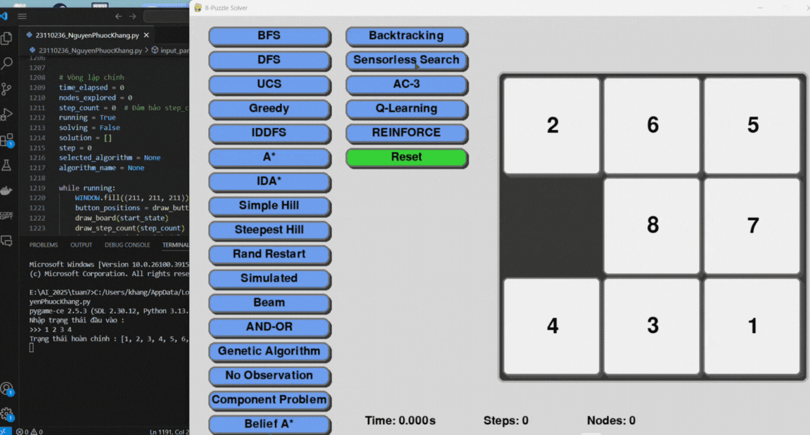

1. Mục tiêu

Mục tiêu của dự án này là xây dựng một ứng dụng tương tác có khả năng giải quyết bài toán 8-Puzzle thông qua việc triển khai và so sánh nhiều thuật toán tìm kiếm trí tuệ nhân tạo trong một môi trường đồ họa trực quan.

Thông qua dự án, người thực hiện hướng đến các mục tiêu cụ thể sau:

    -Áp dụng lý thuyết trí tuệ nhân tạo vào thực tế, đặc biệt là các chiến lược tìm kiếm trạng thái như tìm kiếm không có thông tin, tìm kiếm có thông tin, tìm kiếm cục bộ, tìm kiếm trong môi trường không xác định và thuật toán học tăng cường.

    -Trực quan hóa quá trình giải bài toán thông qua giao diện đồ họa sử dụng thư viện Pygame, giúp người học hiểu rõ cách thuật toán hoạt động qua từng bước chuyển trạng thái.

    -Phân tích và đánh giá hiệu suất của các thuật toán dựa trên các tiêu chí định lượng như: số bước giải, số lượng node mở rộng, và thời gian thực thi.

    -Khám phá khả năng ứng dụng các thuật toán học tăng cường (Reinforcement Learning) và thuật toán tiến hóa (Genetic Algorithm) trong việc giải quyết các bài toán dạng tổ hợp, nhằm tìm hiểu giới hạn và khả năng tổng quát hóa của các phương pháp này.

    -Tăng cường kỹ năng lập trình thuật toán, tối ưu hóa mã nguồn và kiểm thử phần mềm, đồng thời nâng cao khả năng trình bày báo cáo kỹ thuật, đặc biệt là trình bày logic thuật toán dưới dạng mô phỏng.

2. Nội dung

    2.1. Các thuật toán Tìm kiếm không có thông tin

        2.1.1 Breadth-First Search (BFS)
            Trạng thái: Mảng 1 chiều gồm 9 ô, đại diện cho bảng 3x3 (0 là ô trống).
            Trạng thái ban đầu: [2, 6, 5, 0, 8, 7, 4, 3, 1]
            Trạng thái đích: [1, 2, 3, 4, 5, 6, 7, 8, 0].
            Phép toán: Di chuyển 0 lên, xuống, trái, phải nếu hợp lệ.
            Chi phí: Mỗi bước có chi phí bằng 1.

            Solution: Là chuỗi bước ngắn nhất từ trạng thái ban đầu đến đích, được lưu dưới dạng danh sách các cặp (from_idx, to_idx).

        2.1.2 Depth-First Search (DFS)
            Trạng thái: Mảng 1 chiều gồm 9 ô, đại diện cho bảng 3x3 (0 là ô trống).
            Trạng thái ban đầu: [2, 6, 5, 0, 8, 7, 4, 3, 1]
            Trạng thái đích: [1, 2, 3, 4, 5, 6, 7, 8, 0]
            Phép toán: Di chuyển 0 lên, xuống, trái, phải nếu hợp lệ.
            Chi phí: Mỗi bước có chi phí bằng 1.

            Solution: DFS mở rộng node theo chiều sâu thay vì chiều rộng.
            Tuy không đảm bảo tìm được đường đi ngắn nhất, nhưng có thể nhanh hơn nếu lời giải nằm ở nhánh đầu.
            Nếu không giới hạn độ sâu, thuật toán dễ rơi vào vòng lặp vô hạn.
            Solution được lưu dưới dạng danh sách các bước (from_idx, to_idx) dẫn đến trạng thái đích.

        2.1.3 Uniform Cost Search (UCS)
            Trạng thái: Mảng 1 chiều gồm 9 ô, đại diện cho bảng 3x3 (0 là ô trống).
            Trạng thái ban đầu: [2, 6, 5, 0, 8, 7, 4, 3, 1]
            Trạng thái đích: [1, 2, 3, 4, 5, 6, 7, 8, 0]
            Phép toán: Di chuyển 0 lên, xuống, trái, phải nếu hợp lệ.
            Chi phí: Mỗi bước có chi phí bằng 1.

            Solution: UCS sử dụng hàng đợi ưu tiên (priority queue) để 
            chọn bước đi có tổng chi phí nhỏ nhất tính đến hiện tại.
            Trong bài toán này, vì mọi bước đều có chi phí bằng nhau, UCS cho kết quả giống BFS nhưng có thêm chi phí xử lý heap.
            Solution là chuỗi bước hợp lệ tối ưu, được lưu dưới dạng các cặp (from_idx, to_idx).

        2.1.4 Iterative Deepening Depth-First Search (IDDFS)
            Trạng thái: Mảng 1 chiều gồm 9 ô, đại diện cho bảng 3x3 (0 là ô trống).
            Trạng thái ban đầu: [2, 6, 5, 0, 8, 7, 4, 3, 1].
            Trạng thái đích: [1, 2, 3, 4, 5, 6, 7, 8, 0]
            Phép toán: Di chuyển 0 lên, xuống, trái, phải nếu hợp lệ.
            Chi phí: Mỗi bước có chi phí bằng 1.

            Solution: IDDFS là sự kết hợp giữa DFS và BFS.
            Thuật toán thực hiện DFS nhiều lần với các giới hạn độ sâu tăng dần cho đến khi tìm được lời giải.
            Ưu điểm của IDDFS là tiết kiệm bộ nhớ như DFS, nhưng vẫn có thể tìm được lời giải tối ưu nếu chi phí mỗi bước là như nhau.
            Solution là chuỗi bước đầu tiên tìm được tại độ sâu tối thiểu và được lưu dưới dạng danh sách (from_idx, to_idx).

        2.1.5. Nhận xét về hiệu suất của các thuật toán Tìm kiếm không có thông tin

            Khi áp dụng vào trò chơi 8 ô chữ (8-Puzzle), mỗi thuật toán trong nhóm Uninformed Search có những ưu nhược điểm riêng:

                BFS là thuật toán ổn định và đáng tin cậy nhất trong nhóm này. Nó luôn tìm ra đường đi ngắn nhất nếu tồn tại, nhưng phải đánh đổi bằng việc mở rộng rất nhiều trạng thái trong bộ nhớ.

                DFS có lợi thế về tốc độ và sử dụng ít bộ nhớ hơn, tuy nhiên dễ rơi vào nhánh sai, không đảm bảo tìm được lời giải tối ưu, đặc biệt với trạng thái ban đầu phức tạp.

                UCS đảm bảo tìm lời giải tối ưu tương tự như BFS trong trường hợp mọi bước đi có cùng chi phí, nhưng vận hành nặng hơn do phải xử lý hàng đợi ưu tiên.

                IDDFS kết hợp ưu điểm của DFS và BFS, vừa tiết kiệm bộ nhớ vừa đảm bảo tìm được lời giải tối ưu. Tuy nhiên, nó phải lặp lại quá trình tìm kiếm nhiều lần ở các độ sâu khác nhau, dẫn đến thời gian thực thi lớn hơn đáng kể.

            Trong nhóm các thuật toán không có thông tin, BFS là lựa chọn tốt nhất khi cần một giải pháp đơn giản, đảm bảo tìm lời giải ngắn nhất và dễ kiểm soát. Với bài toán 8 ô chữ có không gian trạng thái vừa phải – BFS hoạt động hiệu quả và là tiêu chuẩn so sánh cho các phương pháp khác.

    2.2. Các thuật toán Tìm kiếm có thông tin

        2.2.1 Greedy Best-First Search
            Trạng thái: Mảng 1 chiều gồm 9 ô, đại diện cho bảng 3x3 (0 là ô trống).
            Trạng thái ban đầu: [2, 6, 5, 0, 8, 7, 4, 3, 1]
            Trạng thái đích: [1, 2, 3, 4, 5, 6, 7, 8, 0]
            Phép toán: Di chuyển 0 lên, xuống, trái, phải nếu hợp lệ.
            Chi phí: Mỗi bước có chi phí bằng 1.

            Solution: Greedy chọn node có giá trị heuristic nhỏ nhất (Manhattan distance) mà không xét chi phí đã đi.
            Tốc độ nhanh, ít mở rộng node nhưng có thể bỏ qua lời giải tối ưu.
            Solution là chuỗi bước đi được chọn theo hướng gần goal nhất.

        2.2.2 A* Search
            Trạng thái: Mảng 1 chiều gồm 9 ô, đại diện cho bảng 3x3 (0 là ô trống).
            Trạng thái ban đầu: [2, 6, 5, 0, 8, 7, 4, 3, 1]
            Trạng thái đích: [1, 2, 3, 4, 5, 6, 7, 8, 0]
            Phép toán: Di chuyển 0 lên, xuống, trái, phải nếu hợp lệ.
            Chi phí: Mỗi bước có chi phí bằng 1.

            Solution: A* sử dụng tổng chi phí đã đi (g(n)) và heuristic ước lượng (h(n)), tức f(n) = g(n) + h(n).
            Thuật toán này luôn tìm được đường đi ngắn nhất nếu h(n) là admissible (Manhattan).
            Solution được tối ưu cả về độ dài và số node mở rộng.

        2.2.3 IDA* (Iterative Deepening A*)
            Trạng thái: Mảng 1 chiều gồm 9 ô, đại diện cho bảng 3x3.
            Trạng thái ban đầu: [2, 6, 5, 0, 8, 7, 4, 3, 1]
            Trạng thái đích: [1, 2, 3, 4, 5, 6, 7, 8, 0]
            Phép toán: Di chuyển 0 lên, xuống, trái, phải nếu hợp lệ.
            Chi phí: Mỗi bước có chi phí bằng 1.

            Solution: IDA* kết hợp ưu điểm của A* và IDDFS: sử dụng f(n) = g(n) + h(n) và cắt tỉa theo ngưỡng.
            Giảm bộ nhớ so với A*, đảm bảo tìm lời giải tối ưu, nhưng thời gian thực thi lâu hơn do phải lặp lại nhiều lần.
            Solution được lưu như danh sách bước hợp lệ đến goal.

        2.2.4 Nhận xét về hiệu suất của các thuật toán Tìm kiếm không có thông tin

            Greedy Best-First Search

                Ưu điểm lớn nhất là tốc độ nhanh và số node mở rộng ít.
                Tuy nhiên, do chỉ quan tâm đến khoảng cách ước lượng đến đích (h(n)) mà không xét chi phí đã đi (g(n)), nên Greedy dễ bị đi vòng, dẫn đến lời giải không tối ưu hoặc bị kẹt trong cấu trúc mê cung của trạng thái.
                Greedy hoạt động tốt nếu trạng thái đơn giản, nhưng thiếu ổn định ở các trạng thái khó.

            A Search*

                Là thuật toán nổi bật nhất trong nhóm vì kết hợp được cả chi phí thực tế (g(n)) và heuristic (h(n)) thông qua công thức f(n) = g(n) + h(n).
                Trong bài toán 8-Puzzle, khi sử dụng heuristic Manhattan, A* luôn tìm được lời giải ngắn nhất nếu tồn tại và heuristic là admissible.
                A* có thể mở rộng nhiều node hơn Greedy nhưng đổi lại độ chính xác và tối ưu là vượt trội.

            IDA (Iterative Deepening A)**

                IDA* giữ nguyên tính tối ưu của A* nhưng sử dụng chiến lược sâu dần (Iterative Deepening) để tiết kiệm bộ nhớ.
                Tuy nhiên, nó phải lặp lại quá trình tìm kiếm nhiều lần, dẫn đến thời gian thực thi lâu hơn A*.
                IDA* phù hợp khi bộ nhớ bị hạn chế hoặc khi cần đảm bảo độ tối ưu trong điều kiện bộ nhớ thấp.    

            Trong nhóm Tìm kiếm có thông tin:

                A* là lựa chọn tốt nhất nếu muốn tìm lời giải ngắn nhất, đảm bảo tối ưu, và chấp nhận mở rộng nhiều node hơn.
                Greedy nhanh, phù hợp để chạy thời gian thực hoặc trong các trạng thái đơn giản, nhưng không đảm bảo tối ưu.
                IDA* là phương án thay thế tốt cho A* khi muốn tiết kiệm bộ nhớ, dù đánh đổi bằng thời gian.

    2.3. Các thuật toán Tìm kiếm cục bộ (Local Search)

        2.3.1 Simple Hill Climbing
            Trạng thái: Mảng 1 chiều gồm 9 ô, đại diện cho bảng 3x3 (0 là ô trống).
            Trạng thái ban đầu: [2, 6, 5, 0, 8, 7, 4, 3, 1]
            Trạng thái đích: [1, 2, 3, 4, 5, 6, 7, 8, 0]
            Phép toán: Di chuyển 0 lên, xuống, trái, phải nếu hợp lệ.
            Chi phí: Không xét tổng chi phí, chỉ xét heuristic.

            Solution: Ở mỗi bước, thuật toán chọn trạng thái hàng xóm có giá trị heuristic thấp hơn.
            Nếu không có hàng xóm nào tốt hơn → dừng lại. Dễ bị rơi vào cực trị cục bộ.
            Solution là chuỗi các bước cải thiện liên tục đến khi không thể tốt hơn.

        2.3.2 Steepest Ascent Hill Climbing
            Trạng thái: Mảng 1 chiều gồm 9 ô, đại diện cho bảng 3x3 (0 là ô trống).
            Trạng thái ban đầu: [2, 6, 5, 0, 8, 7, 4, 3, 1]
            Trạng thái đích: [1, 2, 3, 4, 5, 6, 7, 8, 0]
            Phép toán: Di chuyển 0 lên, xuống, trái, phải nếu hợp lệ.
            Chi phí: Không xét tổng chi phí, chỉ xét heuristic.

            Solution: Ở mỗi bước, thuật toán duyệt tất cả trạng thái hàng xóm và chọn trạng thái có giá trị heuristic nhỏ nhất.
            Việc chọn tốt nhất giúp giảm khả năng kẹt ở cực trị gần, nhưng vẫn có thể mắc kẹt ở cực trị toàn cục.
            Solution là chuỗi các bước tối ưu cục bộ cho đến khi không còn hàng xóm nào tốt hơn.

        2.3.3 Random Restart Hill Climbing
            Trạng thái: Mảng 1 chiều gồm 9 ô, đại diện cho bảng 3x3 (0 là ô trống).
            Trạng thái ban đầu: [2, 6, 5, 0, 8, 7, 4, 3, 1]
            Trạng thái đích: [1, 2, 3, 4, 5, 6, 7, 8, 0]
            Phép toán: Di chuyển 0 lên, xuống, trái, phải nếu hợp lệ.
            Chi phí: Không xét tổng chi phí, chỉ xét heuristic.

            Solution: Thuật toán thực hiện nhiều lần Hill Climbing từ các trạng thái khởi tạo ngẫu nhiên.
            Nếu bị mắc kẹt cục bộ, nó khởi động lại từ trạng thái mới → tăng khả năng tìm được lời giải tốt hơn.
            Solution là lời giải ngắn nhất trong số các lần chạy, nếu tồn tại.

        2.3.4 Simulated Annealing
            Trạng thái: Mảng 1 chiều gồm 9 ô, đại diện cho bảng 3x3 (0 là ô trống).
            Trạng thái ban đầu: [2, 6, 5, 0, 8, 7, 4, 3, 1]
            Trạng thái đích: [1, 2, 3, 4, 5, 6, 7, 8, 0]
            Phép toán: Di chuyển 0 lên, xuống, trái, phải nếu hợp lệ.
            Chi phí: Không xét tổng chi phí, chỉ xét heuristic và xác suất lựa chọn.

            Solution: Ở mỗi bước, thuật toán có thể chọn cả trạng thái tệ hơn với một xác suất phụ thuộc vào nhiệt độ hiện tại.
            Nhiệt độ giảm dần theo thời gian, giúp kiểm soát độ "mạo hiểm" và tránh rơi vào cực trị.
            Solution là chuỗi bước tìm kiếm với khả năng thoát khỏi điểm kẹt cục bộ.

        2.3.5 Beam Search
            Trạng thái: Mảng 1 chiều gồm 9 ô, đại diện cho bảng 3x3 (0 là ô trống).
            Trạng thái ban đầu: [2, 6, 5, 0, 8, 7, 4, 3, 1]
            Trạng thái đích: [1, 2, 3, 4, 5, 6, 7, 8, 0]
            Phép toán: Di chuyển 0 lên, xuống, trái, phải nếu hợp lệ.
            Chi phí: Không xét tổng chi phí, chỉ xét heuristic.

            Solution: Tại mỗi bước, thuật toán chỉ giữ lại k trạng thái có heuristic tốt nhất để tiếp tục mở rộng.
            Việc giới hạn số lượng trạng thái giúp giảm chi phí tính toán, nhưng dễ bỏ qua lời giải nếu loại sai.
            Solution là chuỗi bước đi từ trạng thái tốt nhất còn lại trong mỗi vòng mở rộng.

        2.3.6 Nhận xét về hiệu suất của các thuật toán Local Search
        
            Simple Hill Climbing

                Thuật toán đơn giản, mỗi bước chỉ chọn trạng thái hàng xóm tốt hơn.
                Tuy nhiên, rất dễ bị kẹt ở cực trị cục bộ nếu xung quanh không có trạng thái nào tốt hơn.
                Trong 8-Puzzle, có thể đứng im giữa chừng nếu chọn nhánh không hợp lý.

            Steepest Ascent Hill Climbing

                Cải tiến hơn Simple Hill Climbing ở chỗ xét tất cả hàng xóm và chọn trạng thái tốt nhất trong số đó.
                Dễ tránh được một số điểm kẹt nhỏ, nhưng vẫn khó thoát khỏi cực trị toàn cục.
                Trong các trạng thái khó, vẫn có thể dừng lại mà không đạt đích.

            Random Restart Hill Climbing

                Giảm rủi ro kẹt cực trị bằng cách chạy nhiều lần Hill Climbing từ các trạng thái khởi đầu khác nhau.
                Nếu một lần bị kẹt → khởi động lại → tăng xác suất tìm được lời giải tốt hơn.
                Kết quả phụ thuộc vào số lần restart và chất lượng khởi tạo ban đầu.
                Trong 8-Puzzle, hiệu quả hơn nhiều so với Simple/Steepest nếu cho phép chạy lặp lại.

            Simulated Annealing

                Có khả năng vượt qua cực trị bằng cách chấp nhận trạng thái tệ hơn với một xác suất nhất định.
                Xác suất này giảm dần theo thời gian (giống như quá trình tôi luyện kim loại – annealing).
                Trong bài toán 8 ô chữ, đây là thuật toán ổn định và hiệu quả nhất trong nhóm Local Search, nếu điều chỉnh thông số nhiệt độ hợp lý.

            Beam Search

                Tối ưu bộ nhớ bằng cách chỉ giữ lại k trạng thái tốt nhất ở mỗi bước (beam width).
                Nếu k quá nhỏ, thuật toán có thể bỏ sót lời giải.
                Nếu k đủ lớn, có thể tìm được kết quả tốt nhanh hơn A*, nhưng không đảm bảo tối ưu.

                
            Simulated Annealing là thuật toán tốt nhất trong nhóm Local Search vì có khả năng thoát khỏi điểm kẹt và khám phá không gian trạng thái tốt hơn.
            Random Restart cũng hiệu quả nếu có đủ số lần thử lại và trạng thái khởi tạo phân tán.
            Simple và Steepest thích hợp cho bài toán đơn giản, nhưng kém hiệu quả ở các trạng thái phức tạp.
            Beam Search hiệu quả với cấu hình phù hợp, nhưng yêu cầu phải chọn k hợp lý để cân bằng giữa tốc độ và độ chính xác.

    2.4. Thuật toán trong môi trường không xác định (Partial / Sensorless Search)

        2.4.1 AND-OR Graph Search

            Trạng thái: Không xác định hoàn toàn; agent chỉ biết trạng thái hiện tại và các hành động khả dĩ.
            Trạng thái ban đầu: [2, 6, 5, 0, 8, 7, 4, 3, 1]
            Trạng thái đích: [1, 2, 3, 4, 5, 6, 7, 8, 0]
            Phép toán: Di chuyển 0 theo 4 hướng nếu hợp lệ.
            Chi phí: Không xét trực tiếp, ưu tiên theo cây kế hoạch.

            Solution:
            AND-OR Search xây dựng một cây kế hoạch với các nút OR (chọn hành động) và nút AND (mọi kết quả của hành động phải đúng).
            Thuật toán xử lý môi trường không chắc chắn bằng cách lập kế hoạch sao cho mọi nhánh đều đảm bảo đi tới đích.
            Solution là cây con trong cây kế hoạch mà tất cả nhánh AND đều thỏa mãn.

        2.4.2 Searching with No Observation

            Trạng thái: Agent không biết trạng thái hiện tại cụ thể, chỉ thực hiện hành động theo logic.
            Trạng thái ban đầu: [2, 6, 5, 0, 8, 7, 4, 3, 1] (nhưng không quan sát được)
            Trạng thái đích: [1, 2, 3, 4, 5, 6, 7, 8, 0]
            Phép toán: Chọn hành động mà không biết chắc mình đang ở đâu.
            Chi phí: Mỗi bước được tính như bình thường.

            Solution:
            Thuật toán chỉ dựa vào logic hành động, không có đầu vào từ cảm biến.
            Agent thực hiện chuỗi hành động mặc định (ví dụ: always left → down → right) cho đến khi đạt đích hoặc loại trừ hết khả năng.
            Solution là danh sách hành động thực hiện được mà không cần quan sát trạng thái.

        2.4.3 Belief A* Search

            Trạng thái: Một tập hợp các trạng thái có thể xảy ra gọi là belief state.
            Trạng thái ban đầu: nhập trạng thái ban đầu.
            Trạng thái đích: [1, 2, 3, 4, 5, 6, 7, 8, 0]
            Phép toán: Mỗi hành động có thể ảnh hưởng đến toàn bộ belief set.
            Chi phí: Ước lượng theo khoảng cách trung bình hoặc cực đại của các trạng thái trong belief.

            Solution:
            Belief A* thực hiện A* trên toàn bộ tập trạng thái có thể, cập nhật dần belief sau mỗi hành động.
            Khi tập belief thu hẹp lại thành trạng thái duy nhất là goal, thuật toán kết thúc.
            Solution là chuỗi hành động dẫn belief từ tập hợp mơ hồ → tập xác định → goal.

        2.4.4 Sensorless Search (Tìm kiếm với trạng thái niềm tin)

            Trạng thái: Không xác định chính xác vị trí hiện tại, agent có tập hợp trạng thái ban đầu (belief set).
            Trạng thái ban đầu: nhập trạng thái ban đầu.
            Trạng thái đích: [1, 2, 3, 4, 5, 6, 7, 8, 0]
            Phép toán: Áp dụng cho tất cả trạng thái trong belief set cùng lúc.
            Chi phí: Không đổi cho mỗi bước.

            Solution:
            Agent thực hiện cùng một hành động trên tất cả trạng thái trong belief set.
            Sau mỗi bước, belief set được cập nhật lại.
            Khi tất cả các trạng thái trong belief đều là goal → kết thúc.
            Solution là chuỗi hành động giúp thu hẹp không chắc chắn đến trạng thái duy nhất là đích.

        2.4.5. Nhận xét về hiệu suất của các thuật toán trong môi trường không xác định

        AND-OR Graph Search

            Đây là thuật toán có khả năng xử lý tốt các trường hợp có nhiều khả năng xảy ra, nhờ việc xây dựng một cây kế hoạch logic.
            Tuy nhiên, thuật toán này thường tốn rất nhiều tài nguyên tính toán vì phải kiểm tra tất cả các nhánh AND (mọi khả năng đều đúng).
            Trong 8-Puzzle, nếu có quá nhiều trạng thái không chắc chắn, cây kế hoạch sẽ phình to rất nhanh, gây khó khăn cho việc triển khai hiệu quả.

        Searching with No Observation

            Là thuật toán đơn giản nhất trong nhóm. Agent chỉ thực hiện chuỗi hành động cố định mà không cần biết mình đang ở đâu.
            Tuy đơn giản, nhưng hiệu quả kém vì dễ thực hiện những bước vô nghĩa hoặc lặp lại do không có cơ chế phản hồi.
            Phù hợp để minh họa khái niệm "mù hoàn toàn", nhưng không thực tế với những trò chơi cần tối ưu hóa.

        Belief A* Search

            Belief A* là phiên bản tổng quát của A* trong môi trường không xác định.
            Thay vì tìm đường đi cho một trạng thái, thuật toán xử lý tập hợp các trạng thái (belief state) và tìm cách thu hẹp chúng dần về goal.
            Nhờ kết hợp tốt giữa heuristic và logic niềm tin, thuật toán này hoạt động hiệu quả nhất trong nhóm, đặc biệt trong bài toán như 8-Puzzle khi không xác định trạng thái ban đầu.
            Tuy nhiên, chi phí xử lý vẫn cao hơn A* bình thường vì phải cập nhật và mở rộng nhiều belief cùng lúc.

        Sensorless Search

            Thuật toán mô phỏng trường hợp không thể quan sát – agent chỉ biết mình đang nằm trong một tập hợp trạng thái và hành động phải áp dụng cho tất cả trạng thái cùng lúc.
            Sau mỗi hành động, belief được cập nhật. Khi toàn bộ belief hội tụ về goal → kết thúc.
            Cách tiếp cận này an toàn và chắc chắn, nhưng tốc độ hội tụ chậm, vì không có phản hồi để dẫn dắt hành động tốt hơn.

        Trong các thuật toán xử lý môi trường không xác định, Belief A* là lựa chọn tốt nhất vì vẫn tận dụng được heuristic như A*, đồng thời hỗ trợ xử lý tập trạng thái.
        Sensorless Search có tính đảm bảo cao nhưng hiệu suất thấp do mất nhiều bước để thu hẹp belief.
        AND-OR Search phù hợp cho bài toán logic/phức tạp, nhưng quá nặng cho 8-Puzzle vì không gian trạng thái quá lớn.
        Searching with No Observation chỉ mang tính minh họa lý thuyết, hiệu quả thực tế rất thấp.

    2.5. Thuật toán ràng buộc (Constraint-Based Search)

        5.1 Backtracking Search

            Trạng thái:  Mỗi ô của 8-Puzzle được coi là một biến. Miền giá trị là {0..8}.
            Ràng buộc: Không có giá trị nào bị trùng lặp.
            Chi phí: Mỗi bước gán hợp lệ tính là 1 đơn vị.

            Solution:
            Thuật toán lần lượt thử gán giá trị cho từng vị trí và kiểm tra tính hợp lệ tại mỗi bước.
            Nếu xảy ra mâu thuẫn (vi phạm ràng buộc), thuật toán sẽ quay lui (backtrack) và thử nhánh khác.
            Solution là chuỗi gán giá trị thỏa mãn điều kiện không trùng và tạo thành trạng thái đích.

        5.2 AC-3 Algorithm (Arc Consistency – Đảm bảo tính nhất quán cung)

            Trạng thái: Mỗi ô của 8-Puzzle được coi là một biến. Miền giá trị là {0..8}.
            Ràng buộc: Không có hai ô nào được gán cùng một giá trị.
            Chi phí: Mỗi lần kiểm tra và loại bỏ giá trị vi phạm.

            Solution:
            Thuật toán lặp qua tất cả các cặp biến (xi, xj) và loại bỏ những giá trị trong xi khiến cho không thể tìm được giá trị phù hợp trong xj.
            Khi không còn giá trị nào có thể loại bỏ, hệ thống được gọi là arc-consistent.
            Nếu mỗi biến còn đúng 1 giá trị → đó là solution hợp lệ.
            Nếu có biến nào rỗng miền giá trị → không có solution.

   

        2.5.3 Nhận xét về hiệu suất của các thuật toán ràng buộc (Constraint-Based)

            Backtracking Search

                Là giải pháp cơ bản cho bài toán ràng buộc.
                Ưu điểm: đơn giản, dễ cài đặt, hiệu quả trong không gian nhỏ.
                Nhược điểm: dễ bị lặp lại, thời gian tăng rất nhanh nếu không có cắt tỉa.
                Trong 8-Puzzle, nếu không có heuristic hoặc thêm kỹ thuật nâng cao, thời gian giải lâu và khó mở rộng.

            AC-3 Algorithm

                AC-3 là kỹ thuật lọc ràng buộc rất mạnh, giúp giảm không gian tìm kiếm trước khi áp dụng giải thuật khác.
                Ưu điểm: giúp hệ thống loại bỏ giá trị mâu thuẫn sớm, tránh phải thử sau này.
                Nhược điểm: không tạo solution trực tiếp, chỉ là bước tiền xử lý hoặc kiểm tra tính hợp lệ.
                Khi áp dụng vào 8-Puzzle, AC-3 hữu ích trong việc kiểm tra trạng thái có consistent hay không, nhưng không thể tự tìm ra đường đi đến goal.

        
        Backtracking là giải pháp toàn cục nhưng hiệu suất thấp nếu không có cắt tỉa.
        AC-3 là bước hỗ trợ mạnh mẽ để đảm bảo ràng buộc trước khi giải bài toán, nhưng không phải là thuật toán tìm lời giải.
        Trong 8-Puzzle, nhóm Constraint-Based Search không phù hợp để tìm đường đi, nhưng lại rất hiệu quả khi dùng để xác minh trạng thái hợp lệ hoặc kết hợp với thuật toán khác (như Backtracking + AC-3).

    2.6. Thuật toán tiến hóa và học tăng cường (Evolutionary & Reinforcement Learning)

        2.6.1 Genetic Algorithm

            Trạng thái: Mỗi cá thể là một chuỗi hoán vị của các số từ 0 đến 8 (ứng với một trạng thái của 8-Puzzle).
            Trạng thái ban đầu: Một quần thể cá thể được khởi tạo ngẫu nhiên.
            Trạng thái đích: [1, 2, 3, 4, 5, 6, 7, 8, 0]
            Phép toán: Lai ghép (crossover), đột biến (mutation), và chọn lọc (selection) dựa vào hàm fitness.
            Chi phí: Tính theo số thế hệ cần để tìm được cá thể khớp trạng thái đích.

            Solution:
            Thuật toán mô phỏng quá trình tiến hóa tự nhiên.
            Ở mỗi thế hệ, chọn các cá thể tốt nhất theo hàm fitness (Manhattan distance), sau đó lai ghép và đột biến để tạo thế hệ mới.
            Quá trình này lặp lại đến khi tìm được cá thể chính xác hoặc đạt số vòng lặp giới hạn.
            Solution là một trạng thái gần đích hoặc chính xác đích, không phải chuỗi di chuyển cụ thể.

            2.6.2 Q-Learning (Reinforcement Learning)

                Trạng thái: Mỗi trạng thái là một cấu hình của 8 ô.
                Trạng thái ban đầu: [2, 6, 5, 0, 8, 7, 4, 3, 1]
                Trạng thái đích: [1, 2, 3, 4, 5, 6, 7, 8, 0]
                Phép toán: Di chuyển 0 theo 4 hướng hợp lệ.
                Chi phí: Thưởng +100 nếu đạt goal, -1 nếu không; cập nhật bảng Q.

                Solution:
                Thuật toán học chính sách hành động tối ưu qua việc tương tác với môi trường.
                Sử dụng bảng Q để lưu trữ giá trị của từng hành động tại mỗi trạng thái.
                Sau khi huấn luyện qua nhiều lần thử, agent có thể thực hiện giải bài toán bằng cách chọn hành động có Q-value cao nhất tại mỗi bước.
                Solution là chuỗi hành động tốt nhất được học để đến đích từ trạng thái ban đầu.

            2.6.3 REINFORCE (Policy Gradient)

                Trạng thái: Tương tự Q-Learning – mỗi trạng thái là một cấu hình của 8 ô.
                Trạng thái ban đầu: [2, 6, 5, 0, 8, 7, 4, 3, 1]
                Trạng thái đích: [1, 2, 3, 4, 5, 6, 7, 8, 0]
                Phép toán: Di chuyển 0 theo 4 hướng hợp lệ.
                Chi phí: Tính theo tổng phần thưởng nhận được trong mỗi episode.

                Solution:
                Thay vì dùng bảng Q, REINFORCE sử dụng chính sách xác suất (probabilistic policy) và cập nhật trực tiếp trọng số qua gradient.
                Agent chọn hành động dựa trên xác suất (softmax), sau đó cập nhật chính sách để tăng khả năng chọn hành động mang lại phần thưởng cao.
                Solution là chính sách dẫn đến chuỗi hành động tối ưu sau quá trình học.

            2.6.4 Nhận xét về hiệu suất của các thuật toán tiến hóa và học tăng cường

                Genetic Algorithm
                    Thích hợp cho bài toán tìm trạng thái đích mà không cần biết rõ đường đi.
                    Có thể tìm được trạng thái tối ưu sau nhiều thế hệ, nhưng không cung cấp trực tiếp chuỗi hành động giải bài toán.
                    Phụ thuộc nhiều vào việc thiết kế hàm fitness và tham số như mutation rate, population size.

                Q-Learning
                    Cho phép agent học chính sách giải quyết bài toán thông qua tương tác.
                    Sau khi huấn luyện đủ lâu, có thể giải nhanh và chính xác các trạng thái đã học.
                    Tuy nhiên, cần nhiều thời gian huấn luyện và bộ nhớ nếu không gian trạng thái lớn.

                REINFORCE
                    Là mô hình học chính sách trực tiếp, không cần lưu bảng Q.
                    Dễ tích hợp với mạng nơ-ron sâu trong các hệ thống phức tạp.
                    Nhược điểm: biến thiên gradient lớn, cần kỹ thuật chuẩn hóa phần thưởng, dễ bị học chậm nếu thiết kế chưa tốt.

                Q-Learning là lựa chọn tối ưu nếu cần giải 8-Puzzle nhiều lần và có thời gian để huấn luyện từ trước.
                Genetic Algorithm phù hợp nếu muốn tìm lời giải dưới dạng trạng thái đích (không phải đường đi), hoặc kết hợp với các phương pháp khác.
                REINFORCE mạnh mẽ nhưng phức tạp hơn, phù hợp cho hệ thống có nhiều biến và yêu cầu chính sách mềm dẻo.